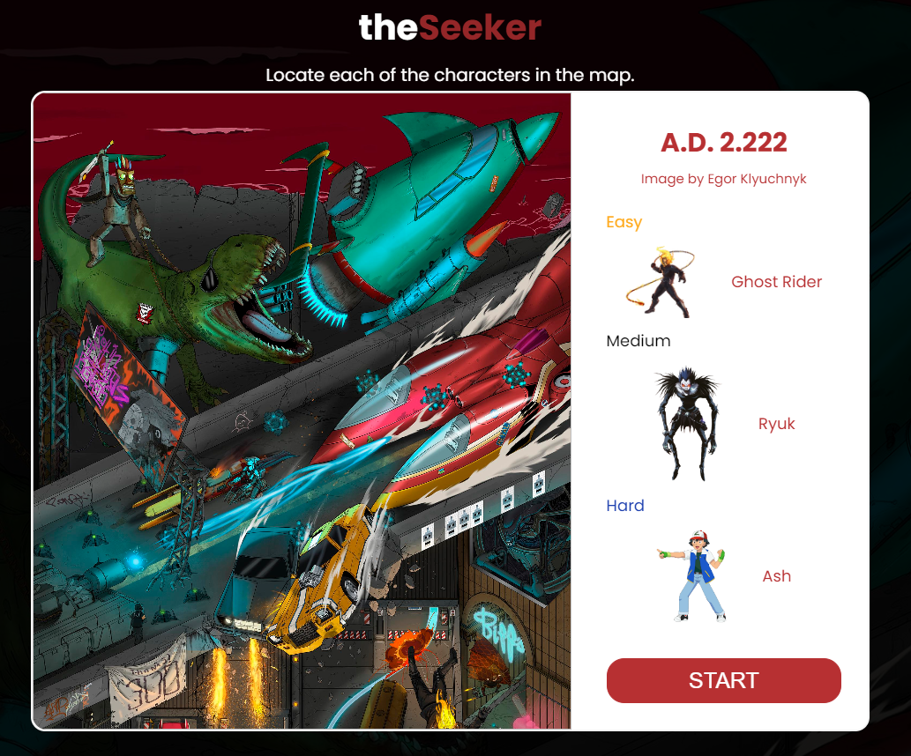
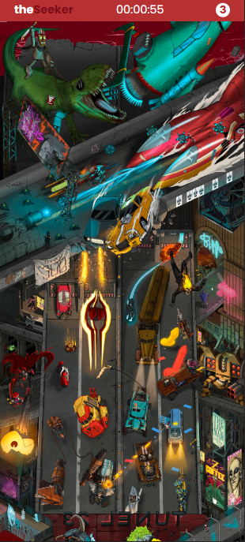
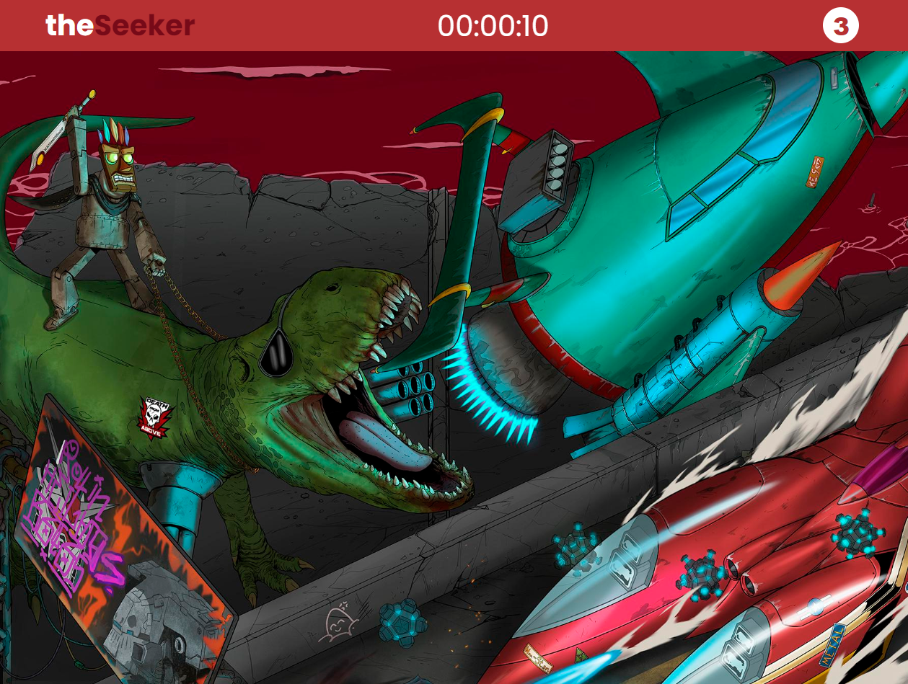
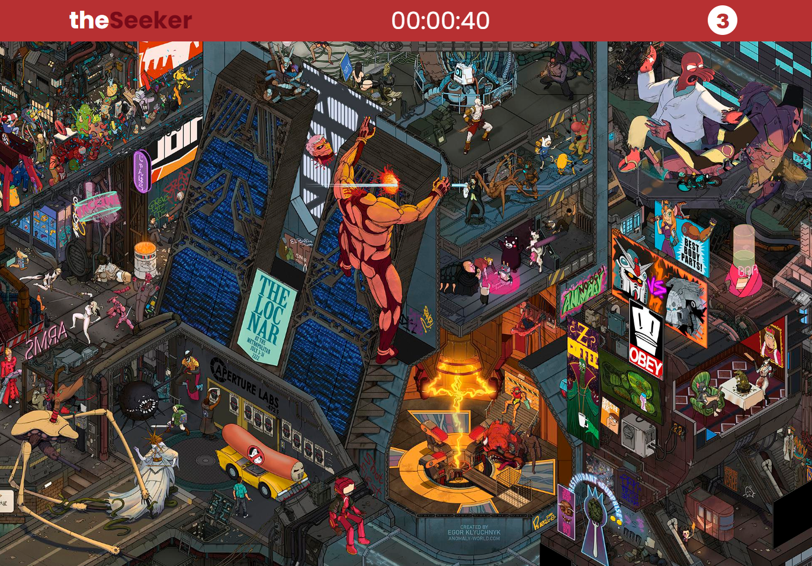
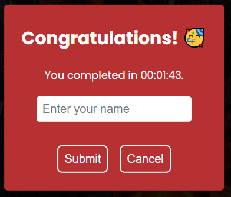
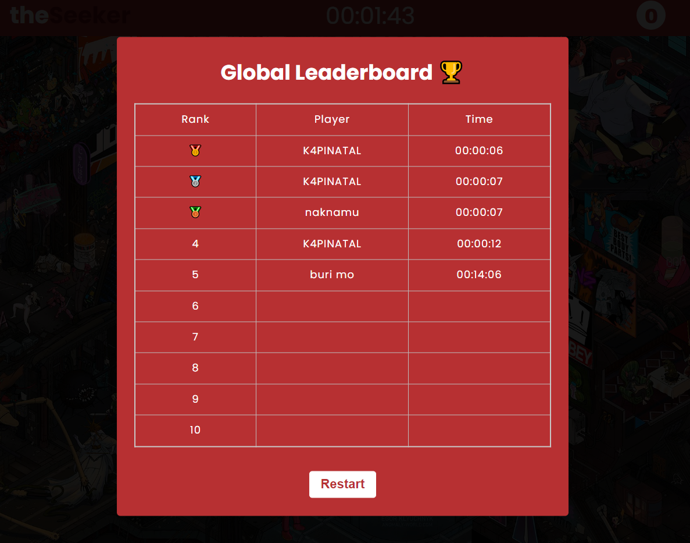

# theSeeker

## Description

A [Wheres Waldo](https://en.wikipedia.org/wiki/Where's_Wally%3F) type of game where you find a character on a large picture with lots of characters.  
Did it make sense? 

First full stack project I have created that uses the front end and back end technology.

## Live Demo

You can check the live website [here!](https://naknamu.github.io/theSeeker/) :fire:

## Features

- Responsive Design
- Global Leaderboards
- Clean UI

## Project Images

### Start Panel

### Gameplay Screen in 

#### Mobile Device

#### Desktop

### Game Over Screen

### Global Leaderboard

## Development

### Front End Technologies

- [ReactJS](https://reactjs.org/)
- [styled-omponents](https://styled-components.com/)
- [react-img-mapper](https://www.npmjs.com/package/react-img-mapper)

### Back End Technologies

- [Firebase](https://firebase.google.com/)
